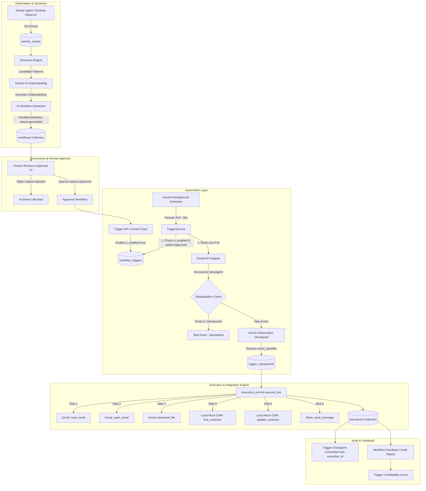

# WorkFlowOS — System Architecture & Automation Engine

## 1. Executive Summary

WorkFlowOS is an AI-powered, OS-level workflow automation operating system that discovers, understands, synthesizes, approves, and automatically executes multi-application business processes.

The master lifecycle consists of 10 coordinated phases:
```
OBSERVE
   ↓
DISCOVER
   ↓
UNDERSTAND
   ↓
GENERATE
   ↓
APPROVE
   ↓
ENABLE AUTOMATION
   ↓
AUTOMATIC TRIGGER
   ↓
EXECUTE
   ↓
AUDIT
   ↓
LEARN / FEEDBACK
```

---

## 2. Master System Architecture



---

## 3. Core Architectural Principles

### 3.1 Hard Human-in-the-Loop Governance
- Automatic triggering and execution **strictly enforce** `workflow.status == "approved"`.
- Any workflow with `status="generated"`, `status="rejected"`, or unapproved status is mathematically blocked from enabling automation (`409 Conflict`) and rejected by the TriggerService runtime guard.
- No AI model can rewrite or alter approved execution pipelines autonomously.

### 3.2 Two-Tier Deduplication & Concurrency Protection
1. **Fast-path query check**: `is_event_processed(workflow_id, event_identifier)` checks existing checkpoints.
2. **Atomic MongoDB reservation claim**: Inserts a `TriggerCheckpoint` with a unique compound index:
   ```python
   Index: ("workflow_id", 1), ("event_identifier", 1), unique=True
   ```
   If two pollers or workers process the same email concurrently, only one can insert the reservation document; the second receives a `DuplicateCheckpointError` and safely aborts.
3. **Deterministic Idempotency Key**: Generated as `trigger:{workflow_id}:{messageId}`, ensuring that even if re-dispatched, the execution service returns the existing execution audit record without re-running actions.

### 3.3 Safe Failure & Retry Policy
- If an execution fails (`FAILED`), the reservation checkpoint is atomically deleted (`delete_checkpoint`).
- This allows transient network failures (e.g., brief timeout) to be retried on subsequent poll cycles.
- When an execution succeeds (`COMPLETED`) or safely stops for human intervention (`NEEDS_INTERVENTION`), the checkpoint is committed with `execution_id`.

### 3.4 Zero External Infrastructure Overhead
- **No Redis**, **No Celery**, **No RQ**, **No Pub/Sub**: The background poller runs as a lightweight, clean `asyncio` task within FastAPI lifespan.
- Automatically disables during pytest to guarantee zero test interference.
- Protects against duplicate scheduler instances across development server hot-reloads.

### 3.5 Security & Least Privilege
- **Gmail Read-Only**: The Google OAuth scope is restricted strictly to `https://www.googleapis.com/auth/gmail.readonly`.
- **Zero Secrets**: OAuth client secrets, refresh tokens, Slack webhook URLs, and API keys reside exclusively in the environment (`.env`).
- **Comprehensive Redaction**: `sanitize_text()` dynamically redacts Google OAuth tokens (`ya29.*`), client secrets (`GOCSPX-*`), Slack tokens (`xox*`), Slack webhooks, and Bearer headers from all execution summaries, logs, and API payloads.
