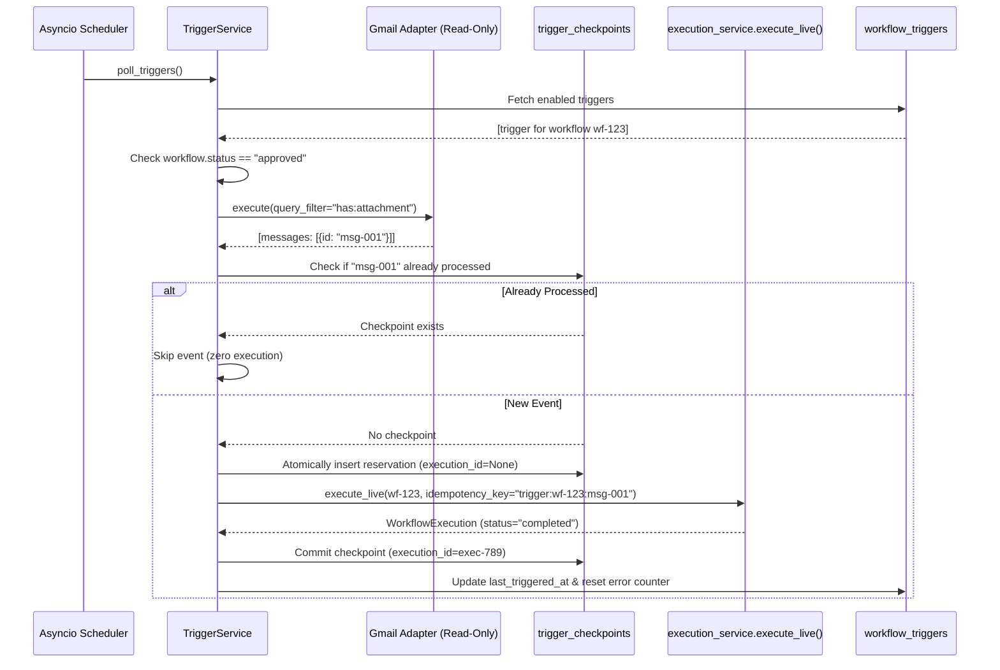

# WorkFlowOS — Automatic Triggering & Deduplication Engine

## 1. Overview

The WorkFlowOS Triggering Subsystem connects incoming real-world events (e.g. customer emails in Gmail) to pre-approved automated workflow execution pipelines without manual human dispatch.

---

## 2. Trigger Configuration Schema

Configured per workflow in MongoDB collection `workflow_triggers`:

| Field | Type | Description |
|---|---|---|
| `trigger_id` | UUID string | Unique identifier for trigger configuration |
| `workflow_id` | string | ID of the target workflow definition |
| `application` | string | Source application (e.g. `Gmail`) |
| `event` | string | Event description (`customer_email_received`) |
| `query_filter` | string (optional) | Source query filter (e.g. `has:attachment` or `label:INBOX is:unread`) |
| `poll_interval_seconds` | integer | Polling frequency in seconds (default: 30, min: 10) |
| `is_enabled` | boolean | Automation toggle (True = Active, False = Paused) |
| `status` | string | Operational state: `ACTIVE`, `PAUSED`, `ERROR` |
| `consecutive_errors` | integer | Error count for failure tracking & health metrics |
| `last_polled_at` | datetime (UTC) | Timestamp of last poll cycle |
| `last_triggered_at` | datetime (UTC) | Timestamp of last execution dispatch |

---

## 3. Operational States

- **OFF / PAUSED**: Trigger exists and is configured, but will not poll or dispatch executions (`is_enabled=False`, `status="paused"`).
- **ACTIVE**: Automation is live; polling runs periodically every `poll_interval_seconds` and dispatches new events (`is_enabled=True`, `status="active"`).
- **ERROR**: Consecutive polling or dispatch errors occurred; surfaced in the UI with error metrics and alert banners (`status="error"`).

---

## 4. Trigger REST APIs

All endpoints are mounted under `/api/v1/triggers`:

| Method | Path | Description |
|---|---|---|
| `GET` | `/api/v1/triggers` | List all trigger configurations (optional `?is_enabled=true`) |
| `GET` | `/api/v1/triggers/{workflow_id}` | Fetch trigger configuration for specific workflow |
| `POST` | `/api/v1/triggers/{workflow_id}/enable` | Enable trigger automation (requires workflow `status == 'approved'`) |
| `POST` | `/api/v1/triggers/{workflow_id}/disable` | Disable trigger automation |
| `POST` | `/api/v1/triggers/{workflow_id}/poll` | Run an immediate on-demand controlled poll cycle |
| `GET` | `/api/v1/triggers/{workflow_id}/feedback` | Fetch structured reliability score, completion rate & feedback |

---

## 5. End-to-End Trigger Lifecycle

---

## 6. Deduplication Guarantees

Because Gmail access is strictly **read-only** (`gmail.readonly`), WorkFlowOS cannot mark messages as read in Gmail. Idempotency is guaranteed locally in MongoDB:
1. **Compound Unique Index**: `idx_wf_event_dedup` on `(workflow_id, event_identifier)`.
2. **Deterministic Idempotency Key**: `trigger:{workflow_id}:{messageId}`.
3. Even if re-polled, the event is detected as already checkpointed and immediately skipped.
